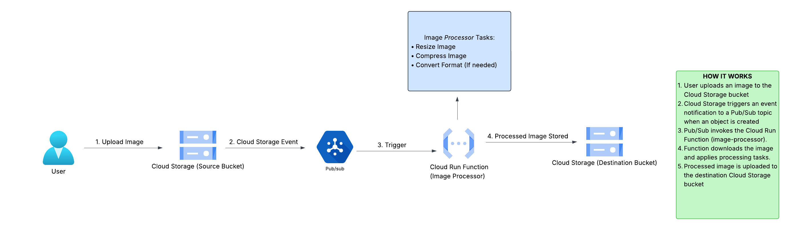
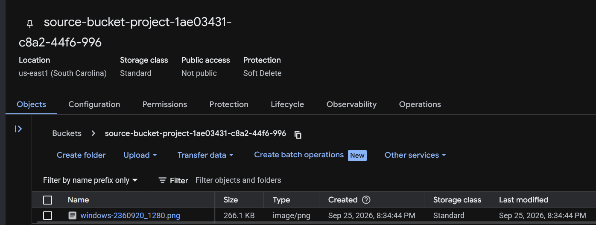
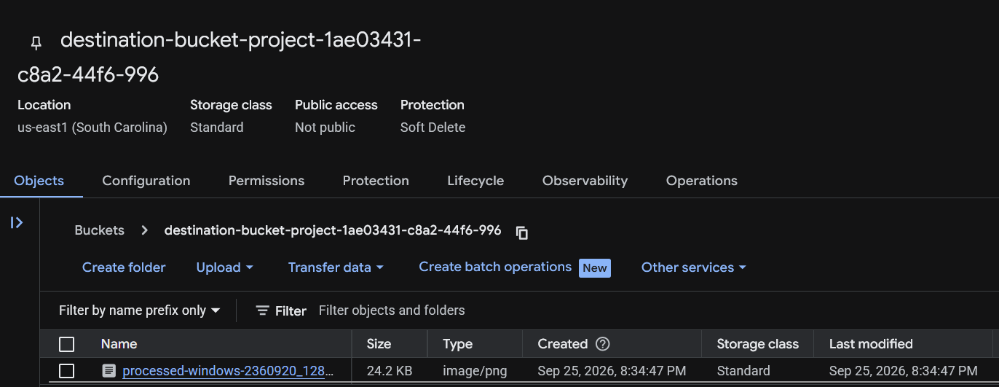

# gcp-serverless-image-pipeline

## 1. Project Overview
This document outlines the deployment of an event-driven, serverless image processing pipeline using GCP Cloud Run Functions. The system automatically intercepts image upload events, normalizes color spaces, resizes dimensions while maintaining aspect ratio, and applies lossless/lossy compression before storing the output in a target Cloud Storage bucket.

---

## 2. Architecture Diagram


---

## 3. Step 1: Cloud Storage Buckets Creation
### a. Create Cloud Storage Buckets
1. Navigate to the Google Cloud Console.
2. Create a new bucket to act as the source bucket (e.g., `source-bucket-xyz`).
3. Create a second bucket to act as the destination bucket (e.g., `destination-bucket-xyz`).

---

## 4. Step 2: Pub/Sub Topic and Event Notification Setup
### a. Create a Pub/Sub Topic:
1. Open Cloud Shell and execute:
   ```bash
   TOPIC=add_image
   gcloud pubsub topics create $TOPIC

### b. Configure Storage Event Notification:

1. Link the source bucket to publish an event to the Pub/Sub topic when an object is created:
```bash
gcloud storage buckets notifications create gs://SOURCE_BUCKET_NAME \
  --topic=$TOPIC \
  --event-types=OBJECT_FINALIZE

```

## 5. Step 3: Cloud Run Function Configuration

### a. Verify Prerequisites:

1. Ensure `main.py` and `requirements.txt` are present in your current working directory within Cloud Shell.

### b. Deploy Function:

1. Execute the deployment command using the Google Cloud CLI:
```bash
gcloud functions deploy image_processor \
  --gen2 \
  --runtime=python313 \
  --region=us-east1 \
  --source=. \
  --entry-point=process_image \
  --trigger-topic=add_image

```


---

## 6. Step 4: IAM & Service Account Configuration

### a. Create a Custom Service Account

Create a custom Service Account following the principle of least privilege:

1. Navigate to **IAM & Admin > Service Accounts** in the Google Cloud Console.
2. Create a new Service Account (e.g., `image-processor-sa`).
3. Grant the role **Cloud Run Invoker** to this Service Account.

### b. Attach the Service Account to the Subscription

1. Navigate to **Pub/Sub > Subscriptions** and select the subscription automatically generated by the function trigger.
2. Edit the subscription settings and assign the Service Account to allow authenticated HTTP requests to Cloud Run.

---

## 7. Step 5: Testing the Pipeline

1. Upload an image to the source Cloud Storage bucket.

   

2. Check the destination Cloud Storage bucket to confirm that the processed image appears with the `processed-` prefix and reduced file size.

   
